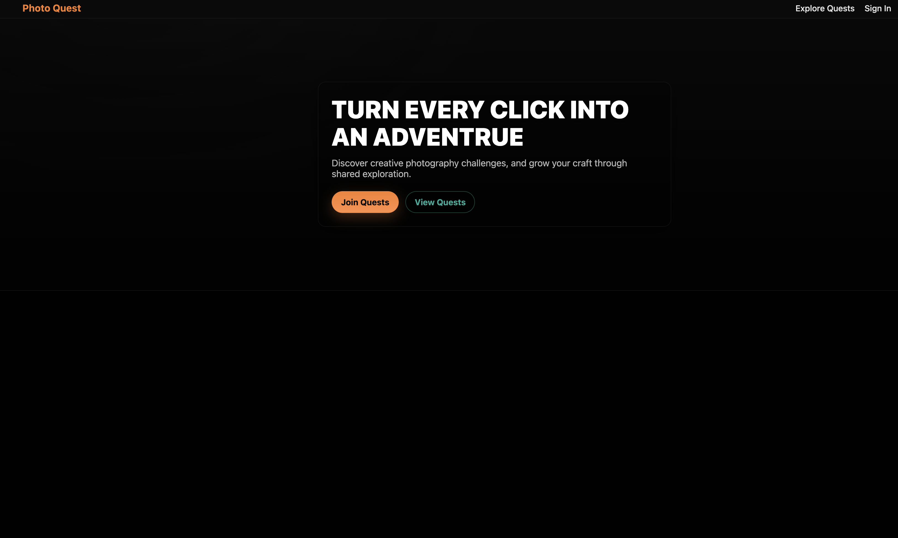

# photoQuest

PhotoQuest is a community web app designed to improve photography skills through fun challenges. Moderators or users can create photo quests – themed challenges such as “Golden Hour Cityscape” or “Macro Texture Challenge”. Photographers then submit their photos for each challenge, showcasing their interpretation of the theme. Users can browse the gallery of submissions, leave comments or likes, and learn from others’ techniques. This platform encourages creativity and learning by prompting photographers to step outside their comfort zone and try new ideas, with a supportive community providing feedback and inspiration.

## Author & Class

- Author: TODO: Add your name (Generated by Codex)
- Class Link: TODO: Add your class link (Generated by Codex)

## Project Objective

Build a vanilla JS + Node/Express app that enables users to create photo quests, submit entries, and exchange feedback via comments, using MongoDB for persistence.

Project is deployed on (https://photoquest.onrender.com/)

## Screenshot



## Quick Start

Prerequisites:

- Node 18+
- MongoDB running locally at `mongodb://localhost:27017/`

Environment variables (create a `.env` file at project root):

```
SUPABASE_URL=your_supabase_project_url
SUPABASE_KEY=your_supabase_anon_key
FRONTEND_BASE_URL=http://localhost:3004
```

Install and run:

```
npm install
npm start
# server runs at http://localhost:3004
```

Lint/format:

```
npx prettier . --write
npx eslint . --ext js,mjs,cjs --fix
```

Deployment (example):

- Deploy Node/Express to your platform of choice (Render/Fly/etc.)
- Set `SUPABASE_URL` and `SUPABASE_KEY` environment variables in the host
- Make sure static files are served from `frontend/`

Note: Supabase is configured with Row Level Security (RLS) in this project; frontend uses the public anon key and the backend exposes `/env.js` for runtime configuration. Do not hardcode secrets beyond anon/public values. (Generated by Codex)

## How To Use (Generated by Codex)

- Browse quests: open `http://localhost:3004/pages/quests.html`
- View a quest: open `http://localhost:3004/pages/quest.html?id=<questId>`
- Create an account (simple email-to-id flow): `http://localhost:3004/pages/login.html`
  - Enter email and submit; app stores a `userId` for session-like behavior.
- Create a new quest (admin/organizer): `http://localhost:3004/pages/newQuest.html`
- Submit a photo to a quest: `http://localhost:3004/pages/newSubmission.html?questId=<questId>`
- View a submission and comments: `http://localhost:3004/pages/submission.html?id=<submissionId>`

## Feature Coverage vs. Personas (Generated by Codex)

- Aspiring Photographer
  - Join/view challenges, submit photos, and comment on entries.
  - Pages: `quests.html`, `quest.html`, `newSubmission.html`, `submission.html`.
- Challenge Organizer (Admin)
  - Create new photo quests with descriptions, tips, tags, and end dates.
  - Page: `newQuest.html`. Data persists to MongoDB.

## API Endpoints (Generated by Codex)

- Quests: `/quests/categories`, `/quests/popular`, `/quests/:userId`, `POST /quests/newQuest`, `DELETE /quests/:id`
- Quest (single): `/quest/:id`
- Submissions: `GET /submissions/byId/:id`, `GET /submissions/byQuestId/:questId?skip&limit`, `POST /submissions/`, `PUT /submissions/:id`, `DELETE /submissions/:id`
- Comments: `GET /comments/bySubmissionId/:submissionId?skip&limit`, `POST /comments/`, `PUT /comments/:id`, `DELETE /comments/:id`

## Notes (Generated by Codex)

- ESLint + Prettier are configured; run `npx eslint . --ext js,mjs,cjs --fix` and `npx prettier . --write` before deployment.
- MongoDB assumed available locally at `mongodb://localhost:27017/`.
- Static frontend served from `frontend/` by Express at `http://localhost:3004`.

## User Personas & Stories:

- **Aspiring Photographer**: A college student new to photography. User Story: As a budding photographer, I want to attempt beginner-friendly photo challenges (with clear themes and tips) so that I can practice and improve my skills one step at a time.

- **Challenge Organizer (Admin)**: An expert setting up quests. User Story: As an admin or challenge creator, I want an easy interface to create new photo challenges (with descriptions and deadlines) so that I can regularly provide fresh themes and keep the community active.

### Dev log:

Todo:

- [x] Add delete button to quest-cards in Quests Created tab in dashboard.html (this ensures deletion only if user is logged in and created the quest-cards)
- [x] Add an add submission button to quest.html
- [x] Implement delete quest by id (backend done, working on frontend)
- [x] Implement submissions backend. (Create✅, Read✅, Update✅, Delete✅)
- [x] Implement comments backend. (Create✅, Read✅, Update✅, Delete✅)

Note: Parts of the frontend implementation for the submission flow (pages, scripts, styles) are code generated by openAI codex.

## New Submission Flow (Frontend)

- Create submission: `frontend/pages/newSubmission.html` (script: `frontend/scripts/newSubmission.js`)
  - Uploads image to Supabase bucket `photoQuestImage` and posts to `/submissions/`.
  - Access via the “Add submission” button on `pages/quest.html`.
- View submission: `frontend/pages/submission.html` (script: `frontend/scripts/submission.js`)
  - Fetches `/submissions/byId/:id`, shows details and EXIF.
  - Loads and posts comments via `/comments/` and `/comments/bySubmissionId/:submissionId`.

improvements:

- add user confirmation before and after delete, and post operations

bugs and fixes:

- pages/dashboard.html submission, quests should display total number, not paginated one
- priority p3

- pagination does not work for pages/dashboard.html submission, quests
- priority p1
